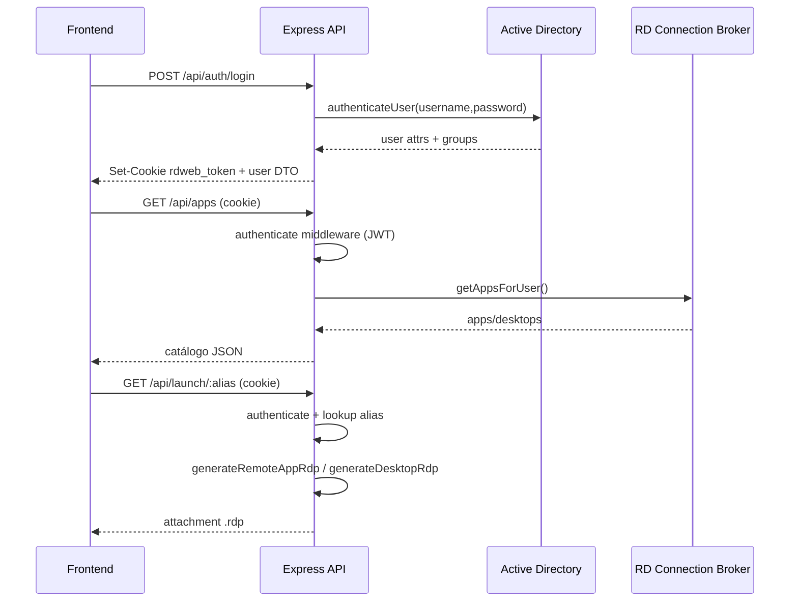

# Contexto IA _BACKEND — RDSWeb-Custom

## 1) Propósito del backend

Este backend (Node.js + Express) funciona como **API de acceso RDS** para:

1. Autenticar usuario (AD real o modo simulación).
2. Emitir sesión vía JWT en cookie `HttpOnly`.
3. Entregar catálogo de recursos RDS (RemoteApps / escritorios).
4. Generar y devolver `.rdp` por alias para lanzamiento.

Es la capa que controla autenticación, autorización y formato de conexión remota.

---

## 2) Componentes principales

### Bootstrap

- `backend/src/index.js`
  - Configura seguridad (`helmet`), CORS, parsers y cookies.
  - Publica rutas `/api/auth`, `/api/apps`, `/api/launch`.
  - Incluye `/api/health` para validación rápida.

### Configuración

- `backend/src/config.js`
  - Centraliza `PORT`, `NODE_ENV`, JWT, LDAP, RDCB, RD Gateway y modo simulación.

### Middleware de sesión

- `backend/src/middleware/authenticate.js`
  - Lee cookie `rdweb_token`.
  - Verifica JWT y llena `req.user`.
  - Responde 401 con códigos consistentes (`NO_TOKEN`, `TOKEN_EXPIRED`, `INVALID_TOKEN`).

### Rutas

- `backend/src/routes/auth.js`
  - `POST /login`, `POST /logout`, `GET /me`.
- `backend/src/routes/apps.js`
  - `GET /` catálogo protegido por JWT.
- `backend/src/routes/launch.js`
  - `GET /:alias` genera `.rdp` dinámico para app/escritorio.

### Servicios

- `backend/src/services/adService.js`
  - Auth con `ldap-authentication` en real.
  - Dataset simulado en desarrollo.
- `backend/src/services/rdcbService.js`
  - Catálogo simulado o consulta WMI/PowerShell al RDCB.
- `backend/src/services/rdpService.js`
  - Plantillas `.rdp` para RemoteApp y Desktop.

---

## 3) Flujo backend (request lifecycle)

---

## 4) Endpoints de contrato

- `GET /api/health`
  - Estado API + modo simulación + broker configurado.
- `POST /api/auth/login`
  - Body: `username`, `password`, `privateMode`.
  - Output: `user` + cookie.
- `POST /api/auth/logout`
  - Limpia cookie de sesión.
- `GET /api/auth/me`
  - Devuelve usuario actual desde JWT.
- `GET /api/apps`
  - Devuelve `{ apps, desktops }`.
- `GET /api/launch/:alias`
  - Descarga `.rdp` para recurso autorizado.

---

## 5) Reglas funcionales claves

1. La sesión se decide en cookie, no en headers Bearer.
2. El catálogo se consulta antes de lanzar, para validar alias vigente.
3. `rdpPath === null` se interpreta como escritorio completo.
4. `privateMode` afecta timeout de cookie y de sesión `.rdp`.
5. En backend, si `privateMode` no viene, launch cae en comportamiento “privado”.

---

## 6) Variables críticas para Windows Server 2019 (RDS)

- `LDAP_URL`, `LDAP_BASE_DN`, `AD_DOMAIN`
- `AD_SERVICE_USER`, `AD_SERVICE_PASS`
- `RDCB_SERVER`
- `RDGATEWAY_HOSTNAME`
- `JWT_SECRET`, `JWT_EXPIRES_IN`
- `SIMULATION_MODE`

Para despliegue real en Server 2019, estas variables son el punto de control principal.

---

## 7) Riesgos técnicos y deuda actual

1. LDAP usa `rejectUnauthorized: false` (aceptable en laboratorio, no ideal en producción).
2. `JWT_SECRET` tiene fallback inseguro en código.
3. WMI/PowerShell puede fallar por permisos, firewall o políticas remotas.
4. No hay capa explícita de observabilidad estructurada (logs/metrics centralizados).
5. No hay cache del catálogo; cada launch vuelve a consultar recursos.

---

## 8) Prioridad de construcción sugerida (backend-first)

1. Endurecer seguridad de entorno (`JWT_SECRET` obligatorio + TLS LDAP válido).
2. Validar conectividad real AD/RDCB en Server 2019.
3. Añadir trazabilidad por request-id y logs operativos.
4. Definir estrategia de errores por códigos (catálogo, launch, AD).
5. Preparar pipeline de smoke tests para `/health`, `/auth/me`, `/apps`, `/launch/:alias`.
