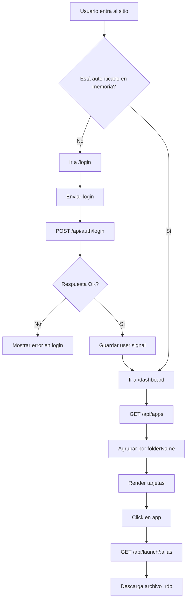

# Contexto IA _FRONTEND — RDSWeb-Custom

## 1) Propósito del frontend

Este frontend (Angular 21 + Material) es la **capa de experiencia de usuario** para el portal RDS:

1. Login seguro.
2. Persistencia de sesión por cookie (vía backend).
3. Visualización y búsqueda de catálogo de apps.
4. Disparo de descarga `.rdp` para abrir recursos remotos.

No autentica por sí mismo: delega toda la seguridad al backend.

---

## 2) Estructura funcional

### Bootstrap y rutas

- `frontend/src/main.ts`
- `frontend/src/app/app.ts`
- `frontend/src/app/app.routes.ts`

Rutas activas:

- `/login` (solo invitado)
- `/dashboard` (solo autenticado)

### Capa core

- `core/services/auth.service.ts`
  - Estado de usuario con `signal`.
  - `login`, `logout`, `fetchMe`, `isAuthenticated`.
- `core/services/apps.service.ts`
  - Obtiene catálogo y construye URL de launch.
  - Lanza descarga `.rdp` creando enlace temporal.
- `core/guards/auth.guard.ts`
  - Protege dashboard y rehidrata sesión con `/auth/me`.
- `core/interceptors/credentials.interceptor.ts`
  - Fuerza `withCredentials: true` en todas las requests.

### Páginas

- `pages/login/*`
  - Form de usuario/contraseña + selector privado/público.
- `pages/dashboard/*`
  - Navbar, buscador, tarjetas por grupo, tema claro/oscuro, logout.

---

## 3) Flujo frontend de usuario

---

## 4) Estado y sesión en cliente

1. El frontend solo guarda perfil de usuario en memoria (`signal`).
2. El token real vive en cookie `HttpOnly` (invisible al JS cliente).
3. Si se refresca la página y no hay estado en memoria, `authGuard` intenta `/auth/me`.
4. Si `/auth/me` falla, redirige a `/login`.

Este patrón evita almacenar JWT en LocalStorage/SesionStorage.

---

## 5) Integración HTTP

- Base URL en `environment.apiUrl`.
- Dev: `/api` con proxy a `http://localhost:3000`.
- Prod: actualmente apunta a `http://localhost:3000/api` (debe ajustarse al host real).

Dependencias críticas de red:

1. CORS backend debe permitir credenciales.
2. Frontend siempre envía cookie por interceptor/global config.

---

## 6) UX funcional ya implementada

- Login con feedback de carga y error.
- Selector de modo de sesión (privado/público) enviado al backend.
- Dashboard con:
  - Agrupación por carpetas.
  - Búsqueda local por nombre.
  - Indicador de carga/error.
  - Tema dark/light persistido en `localStorage`.
  - Cierre de sesión.

---

## 7) Riesgos o ajustes pendientes en frontend

1. Config de producción (`environment.prod.ts`) debe apuntar a dominio final.
2. Manejo de expiración de sesión puede mejorarse con UX más explícita (toast/modal), hoy depende de redirección guard.
3. `withCredentials` se configura tanto en interceptor como en llamadas puntuales (redundante).
4. Launch por `<a>` temporal funciona, pero depende del comportamiento del navegador con descargas y cookies.

---

## 8) Prioridad de construcción sugerida (frontend)

1. Preparar variables/env por ambiente real (QA/PROD).
2. Añadir estado global de sesión expirada para UX consistente.
3. Normalizar llamadas HTTP para evitar duplicación de opciones.
4. Añadir pruebas unitarias de guards y servicios críticos.
5. Afinar textos y flujos de error para soporte operativo.
